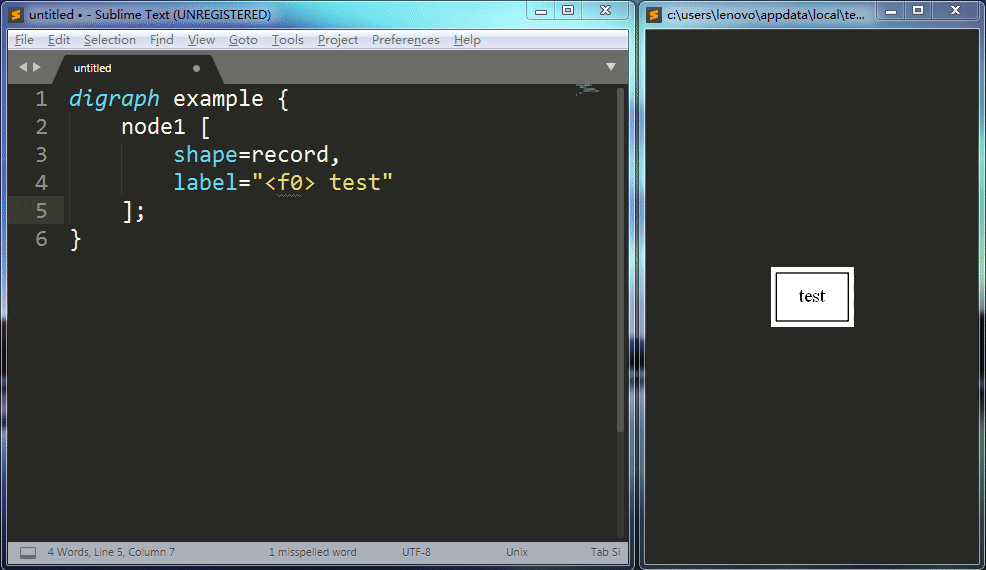

# Graphvizer

`Graphvizer` is a `Graphviz` plugin for Sublime Text 3. It can simplify the process of writing `dot` files. You just need to edit your file and this plugin will render the image and refresh it in real time. If the syntax is invalid, the plugin will show you some error messages.

# Features

* Real-time rendering
* Real-time syntax checking
* Error message prompting

# Usage

**Note: Please ensure the file syntax is set to `Graphviz (DOT)`. You can do this by `View -> Syntax` or clicking the bottom right corner of Sublime Text window.**

* `ctrl+shift+g`: Open image window



* `ctrl+shift+x`: Open `Graphvizer` panel


# Why do I create this plugin?

`Graphviz` is an awesome visualization tool, but it's very inconvenient to write a dot file. I have to use `dot file.dot -Tpng -o file.png` to render image again and again manually and I can't know whether my syntax is correct or not instantly. `Atom` has a good plugin called `GraphViz preview+` which is excellent, but I don't find any plugin can do this in `packagecontrol.io`. Finally, I create `Graphvizer`.

# Installation

## Prerequisites

I can't implement the `Graphviz` visualization algorithm from scratch, so this plugin needs `dot` command to render the image. In other words, you need to install the official `Graphviz` on your system.

### For Linux/Mac

Use your operating system package manager (e.g. dnf or apt-get) to install `Graphviz`.

On my `Fedora 27 X86_64`, the command is:

```
sudo dnf install graphviz
```
Use `dot -V` to make sure you have configured all things. You should see the version info of `Graphviz`.

### For Windows

Download from here: https://graphviz.gitlab.io/download/

After installing `Graphviz`, you should make sure that the `dot` command can be accessed from the command prompt(a.k.a. `cmd`). Otherwise, it can't be invoked by this plugin. To do this, you should add the path of `dot.exe` (e.g. `D:\Graphviz\bin`) to the `PATH` environment variable of your system. If you don't know what the `PATH` is, Google may help you. I won't explain the full details. Sorry about that.

If you think you have completed this step, type `dot -V` in cmd and hit enter. If everything is OK, you will see the version info of Graphviz.

## Installing `Graphvizer`

### Using Package Control

The easiest way to install Graphvizer is through Package Control. You must have known how to do this.

Bring up the Command Palette (`Control+Shift+P` on Linux/Windows, `Command+Shift+P` on Mac). Select `Package Control: Install Package` and then search `Graphvizer` to install it.

### Manually

`git clone` this project to your system or just download the zip file from GitHub and decompress it. Now you have got the `Graphvizer` directory.

Using the Sublime Text 3 menu `Preferences -> Browse Packages...` to find out your package directory path. On my `Windows 7`, the path is `D:\Sublime Text 3\Data\Packages`. Move the entire `Graphvizer` directory into the package directory. Done!

# To-Do List

- [x] Configure the `dot` command path in `Settings`.
- [ ] Key Bindings for Window/Linux/OSX separately.
- [ ] Display image in another layout instead of a new window.
* For other features, please open an issue.

# LICENSE

GNU GENERAL PUBLIC LICENSE Version 2 (GPLv2)